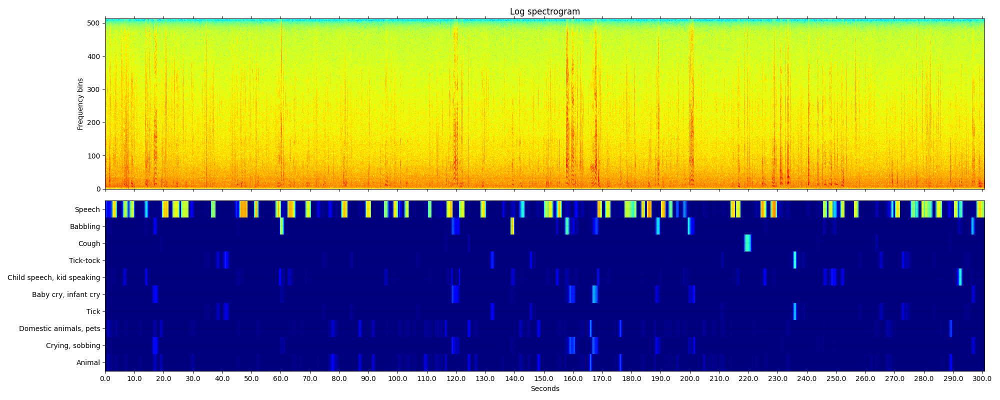
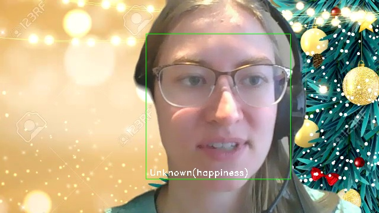

# CPSC-67101

---
This is the project repository for the course Design and Implementation of Database Systems (CPSC-671) at university of Calgary

---
Author: Behnam Nikbakhtbideh

Date: November 2021

---

## Introduction
Emotion Recognition and Sentiment Analysis are kinds of classification problems to detect what emotion/sentiment the human actor has in media or text.

The focus of sentiment analysis is to derive information from human language for interpreting views and feelings to assign a label like positive, negative, or neutral. 
However, emotion detection aims at finding out more specific sentiment tones. 
According to [1], these emotions are limited to six basic categories: <b>happiness, surprise, sadness, anger, fear, and disgust</b>.
In fact, other complex emotional states can be inferred via these universal categories with respect to situations like culture and sex.

Emotion Recognition in Tweets is a kind of emotion recognition that focuses on tweets as input data.
Tweets have some characteristics that make them distinctive from other resources.
One feature is the multimedia nature of tweets that might contain image, audio and video.
But the majority of works in this domain concentrate on text.
The other feature related to social media is that when it comes to analyse data, some special inputs like emoji should be considered in NLP.
Also gaining benefit from the nature of social networks is considered in some of the research.

## Related Work
In terms of input type, techniques in this area could be categorized in three main sections:
### Multi-modal
Most of the work in emotion recognition focus on text because of the fact that tweets are mostly in text.
But in some papers like [2], it tries to fuse both visual and textual models to get a more comprehensive result.

Emotion Recognition can be applied to text, speech, and facial expressions.
So there is a solution to combine the result for each of these problems.
For example, I run these two recognition earlier on some audio and image (or video):
#### Audio
By using tools like [this](https://github.com/qiuqiangkong/audioset_tagging_cnn) that is based on Torch & Pandas, we can analyze a voice (not necessarily speech) and get some classes like 
#### Image
In another sample, I used [this](https://github.com/davisking/dlib) library for emption recognition in images (or video frames), and here is a sample of the result:


The most problematic part of the work here is to combine (or fuse) these results that need specific dataset.
Most of the works use the output of prior classification as input to CNN, and then the problem is to build a model like SVM that minimizes CCC (Concordance Correlation Coefficient).
### Based on social networking characteristics
Some papers try to utilize information that can be gained by social relationships and behaviour.
For example in [3], the focus is on social media features like user’s opinions, amount of user activities (number of tweets for example), and user’s behaviour (for example, periods of being active or inactive). 
### Text-based
Works in this domain concentrate on NLP models to analyze tweets as textual data.
In [4] it uses a non-supervised learning model that requires no manual annotation.
This technique starts with a couple of hashtags like #angry & #happy, or emoticons and assign a label to each tweet, then extends its training set automatically.
The limitation of this technique is that such initial data is not present in all kinds of tweets and it will cause a bias in the training model.

Also in [5], it uses another kind of non-supervised learning model that is based on linguistic and acoustic features of language to automatically assign labels to each tweet.
It seems that this technique doesn’t remove the need for learning, and only transfers it to another level which might decrease accuracy.

On the other hand, supervised models try to construct a model based on training data.
Multiple techniques like SVM, decision-trees and Bayesian models, and also deep-learning models for text classification are provided in this section.

Supervised solutions could be devided in two general parts: <b>statistical models</b> and <b>NLP models</b>.

Statistical models concentrate on entropy features of the language, but in NLP solutions the very basic infrastructure of work is individual words or sentences, and not single characters.
The most important difference in feature extraction that aims to map text into vectors.

Bag of Words is a straightforward technique for feature extraction that the vector is a matrix of words in dictionary with corresponding frequency in the input text. 
Although this is a simple solution, is not efficient because of the sparse matrix with the size equals to the dictionary.
To categorize text (tweet), measures like TFIDF (Term Frequency - Inverse Document Frequency) can be used to normalize vectors and gain more meaningful data instead of raw frequencies.
Meaning that it normalizes frequency against how much the frequency of that word is in document, and how much is in the dictionary.
For example, a word like "world" is quite frequent in english literature and might not convey a special meaning or feeling, but a word like "disgust" can be determinant to find out about semantic state of the text.
After that, some kind of text similarity (Levenshtein Distance for example) can be applied to find the most similar set of texts to the input,
and assign a label (emotion) based on it.

However, one deficiency of these vectors is that they don't preserve the order of the words,
and n-gram solutions can resolve this issue [6].
For example, in a 2-gram model, `"do not worry at all"` will be mapped to a set of bigrams like 
`{"do not", "not worry", "worry at", "at all"}`. 
Here a token like `"not worry"` can be very helpful for detection of emotion, but in ordinary tokenization, even token `"not"` might be dropped by stop-words removal.

On the other hand, statistical approaches might use n-gram based on the characters [7].
In this approach, there is no linguistic dependency between the model and a specific language. 

In addition to these pre-processing steps, other tasks to remove stop-words, doing Stemming or Lemmatization can be helpful in some cases.

## Model
To build a model, I first selected an open-source library [8] and analyzed its accuracy against a dataset [9] with 16000 classified text entries.
Due to some differences between these two models, 14696 entries are analyzed and among them, only 5425 items are classified correctly which makes about 37%, and the overall time was about 16min.
[The source code is available here](cmp_text2emotion.py)

Because of the fact that tweets are different from ordinary text, I run [this](cmp2_text2emotion.py) comparison against another dataset [10] specific to tweets with 40,000 entries.
Also despite the previous examination, I ignored direct translation of classes.
For example, one category like “worry” in the dataset might be related to multiple categories like “fear, sadness, anger” in the model.
By the way, here is a part of the result of this comparison:
```json
{
    "Sad": {
      "empty": 168,
      "sadness": 1505,
      "worry": 1998,
      "hate": 356,
      "neutral": 1267,
      "love": 317,
      "surprise": 294,
      "fun": 207,
      "relief": 229,
      "happiness": 518,
      "enthusiasm": 120,
      "boredom": 45,
      "anger": 18
  }
}
```
Meaning that if we consider {sadness, worry, hate} as one group, it will result in about 55% of accuracy.
For happiness, if we consider {enthusiasm, love, happiness, fun, relief} in one class, it will result in 45% of accuracy.

To know what should be done, first we should find how this library (and some similar libraries) work.
Because of the fact that there isn't a specific framework to combine multiple issues like TFIDF, n-gram, Similarity, Stemming, Classification and so on, I consider this model to pursue.

The flow is as follows:
### Preparation
Removing stop words and redundant characters except emoji characters.
#### Stemming
This is to reduce words to their structural roots.
For example, both two words {book, books} will turn into “book”.
Most of the well-known facilities in this part are based on statistical analysis without considering the meaning of words.
For example, considering the PorterStemmer in nltk library, following transforms are applied:
```
Homes → home
Winning → win
Alone → alon
```
So the result might be semantically problematic.
#### Lemmatization
On the other hand, lemmatization considers the meaning of the word, especially when it uses wordnet network.
#### Tokenization
It is to split text in a set of words.
The simplest way is to split by space characters.
But it could get more strength by wordnets as well.
For example, “european union” might be considered as two or one tokens.
#### Additional processing
like considering “not” as the opposite semantic value, or normalizing term frequencies.
### Model (train or predict/evaluate)
Multiple solutions using Bayesian, SVM, decision-trees (ID3), or deep learning approach could be used to make a relationship between text, words (tokens), and classes.
In the following, I will introduce a model that uses Bayesian model for train/test with a range of pre-processing that is experimented to gain better results.

## Implementation
I use the [nltk](https://www.nltk.org/) that enhances multiple facilities required for this project.

### Setup

First of all, just like any other python application, create your own virtual environment and run this to install required libraries:

```shell
pip install -r ./requirements.txt
```

Then run this command to download the required standard datasets including wordnet and stopwords and punkt (for tokenizer).

```shell
python setup.py
```

This command will download required datasets.

### Preparation

in the file [emotion_recognition.py](emotion_recognition.py) I have implemented a class named <i>TextItem</i> to encapsulate a unit of work for a single tweet or any other text.

This class performs a set of pre-processing as follows:
1. tokenization:
   1. split by space or new line
   2. convert to lowerCase
2. remove stop words and single-character words
3. lemmatize tokens based on the wordnet, in a form that only consider <i>Adj, Noun, Verb, Adv</i>.
4. find synonyms for each token. We might consider this option later for Bayesian Networks.
5. find frequency for each token.

#### Example:

Input: `i am feeling good today because the weather is perfect`

Output:

<b>Tokens</b>:
```json
[
  "feel",
  "good",
  "today",
  "weather",
  "perfect"
]
```
<b>Synonyms</b>:
```json
{
  "feel": [
    "experience",
    "look",
    "tone",
    "feeling",
    "sense",
    "finger",
    "flavour",
    "palpate",
    "smell",
    "flavor",
    "find",
    "spirit",
    "tactile_property"
  ],
  "good": [
    "adept",
    "estimable",
    "skillful",
    "serious",
    "proficient",
    "dependable",
    "secure",
    "safe",
    "near",
    "expert",
    "thoroughly",
    "full",
    "undecomposed",
    "ripe",
    "effective",
    "in_force",
    "right",
    "in_effect",
    "goodness",
    "well",
    "commodity",
    "trade_good",
    "unspoiled",
    "skilful",
    "upright",
    "beneficial",
    "unspoilt",
    "just",
    "dear",
    "salutary",
    "honest",
    "soundly",
    "respectable",
    "practiced",
    "sound",
    "honorable"
  ],
  "today": [
    "nowadays",
    "now"
  ],
  "weather": [
    "conditions",
    "atmospheric_condition",
    "brave_out",
    "brave",
    "endure",
    "weather_condition",
    "upwind"
  ],
  "perfect": [
    "sodding",
    "consummate",
    "utter",
    "thoroughgoing",
    "hone",
    "double-dyed",
    "gross",
    "perfective_tense",
    "staring",
    "everlasting",
    "pure",
    "perfect_tense",
    "stark",
    "unadulterated",
    "arrant",
    "perfective",
    "complete"
  ]
}
```
<b>Frequencies</b>:
```json
{
  "feel": 1,
  "good": 1,
  "today": 1,
  "weather": 1,
  "perfect": 1
}
```

### Classifier

In the first step, I created a class named <i>NltkClassifier</i> in [emotion_recognition.py](emotion_recognition.py)
that utilized a simple Bayesian classifier implemented by NLTK.

I run this classifier against two datasets, in each case, 10% of data is considered as test-set and the remaining as training-set.

It would be possible to train model in a k-fold cross validation environment to overcome some kinds of bias.

In one dataset with about 40,000 entries, it got a very low accuracy result (15%) that is resulted from the nature of its classes. I mean that there is a strict bond between classes like "sadness" and "worry" and Bayesian classifier fails with this kind of classes.

But regarding the 6 basic emotions that are completely independent, In other dataset it got a very better accuracy (72%) which is about two times better than the text2emotion library.


## References
[1] Du, S., Tao, Y., &#38; Martinez, A. M. (2014). Compound facial expressions of emotion. Proceedings of the National Academy of Sciences, 111(15), E1454–E1462. https://doi.org/10.1073/PNAS.1322355111

[2] Lin, C., Hu, P., Su, H., Li, S., Mei, J., Zhou, J., &#38; Leung, H. (2020). SenseMood: Depression detection on social media. ICMR 2020 - Proceedings of the 2020 International Conference on Multimedia Retrieval, 407–411. https://doi.org/10.1145/3372278.3391932

[3] Shen, G., Jia, J., Nie, L., Feng, F., Zhang, C., Hu, T., Chua, T. S., &#38; Zhu, W. (2017). Depression detection via harvesting social media: A multimodal dictionary learning solution. IJCAI International Joint Conference on Artificial Intelligence, 0, 3838–3844. https://doi.org/10.24963/IJCAI.2017/536

[4] SintsovaValentina, &#38; PuPearl. (2016). Dystemo. ACM Transactions on Intelligent Systems and Technology (TIST), 8(1). https://doi.org/10.1145/2912147

[5] Hines, C., Sethu, V., &#38; Epps, J. (2015). Twitter: A new online source of automatically tagged data for conversational speech emotion recognition. ASM 2015 - Proceedings of the 1st International Workshop on Affect and Sentiment in Multimedia, Co-Located with ACM MM 2015, 9–14. https://doi.org/10.1145/2813524.2813529

[6] Abdaoui, Amine, et al. "Feel: a french expanded emotion lexicon." Language Resources and Evaluation 51.3 (2017): 833-855.

[7] Kruczek, J., Kruczek, P., &#38; Kuta, M. (2020). Are n-gram Categories Helpful in Text Classification? Lecture Notes in Computer Science (Including Subseries Lecture Notes in Artificial Intelligence and Lecture Notes in Bioinformatics), 12138 LNCS, 524–537. https://doi.org/10.1007/978-3-030-50417-5_39

[8] aman2656/text2emotion-library. (n.d.). Retrieved November 26, 2021, from https://github.com/aman2656/text2emotion-library

[9] Emotions dataset for NLP | Kaggle. (n.d.). Retrieved November 26, 2021, from https://www.kaggle.com/praveengovi/emotions-dataset-for-nlp?select=train.txt

[10] text_emotion | Kaggle. (n.d.). Retrieved November 26, 2021, from https://www.kaggle.com/maysaasalama/text-emotion/version/1
